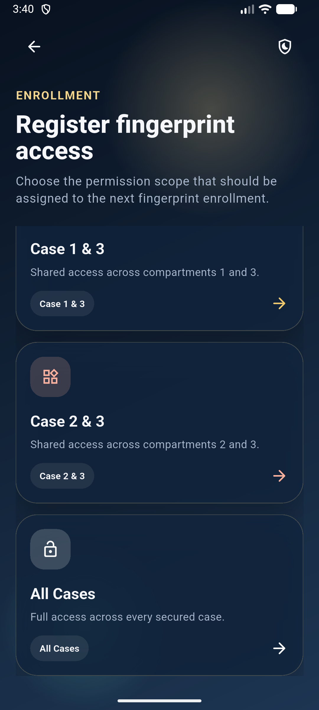

# luxlock_app

A new Flutter project.

## Getting Started

This project is a starting point for a Flutter application.

A few resources to get you started if this is your first Flutter project:

- [Lab: Write your first Flutter app](https://docs.flutter.dev/get-started/codelab)
- [Cookbook: Useful Flutter samples](https://docs.flutter.dev/cookbook)

For help getting started with Flutter development, view the
[online documentation](https://docs.flutter.dev/), which offers tutorials,
samples, guidance on mobile development, and a full API reference.
# LuxLock

LuxLock is a Flutter and ESP32 smart locker system for controlling three secured cases. The mobile app talks to Firebase Realtime Database, while the ESP32 listens for commands, manages fingerprint enrollment, drives the case actuators, and writes status/history logs back to the cloud.

<p align="center">
  
</p>

## Preview

<p align="center">
  
  
  
</p>

## Features

- 4-digit PIN gate before entering the app.
- Fingerprint access registration for Case 1, Case 2, Case 3, shared case combinations, or all cases.
- Master key override for opening, closing, or stopping selected cases.
- Live ESP32 device status through Firebase.
- History logs for authorized access, denied fingerprints, override events, and tamper alerts.
- Firebase Cloud Messaging alerts for tamper and failed fingerprint events.
- Daily Firebase history cleanup through Cloud Functions.
- ESP32 firmware for Wi-Fi, Firebase, fingerprint sensor, tamper events, and actuator control.

## Tech Stack

- Flutter / Dart
- Firebase Auth
- Firebase Realtime Database
- Firebase Cloud Messaging
- Firebase Cloud Functions, Node.js 20
- ESP32 Arduino firmware
- Adafruit Fingerprint Sensor Library
- Firebase ESP client library

## Project Structure

```text
lib/          Flutter app screens, services, models, theme, and widgets
android/      Android Flutter host project
ios/          iOS Flutter host project
macos/        macOS Flutter host project
web/          Web Flutter host project
windows/      Windows Flutter host project
linux/        Linux Flutter host project
functions/    Firebase Cloud Functions for alerts and cleanup
esp32/        ESP32 sketches and wiring notes
test/         Flutter unit/widget tests
```

## Security And Secrets

Real credentials are intentionally not committed.

Ignored local files include:

- `esp32/**/secrets.h`
- `lib/firebase_options.dart`
- `android/app/google-services.json`
- `.env`
- service account JSON files
- private key files

Use the example files as templates:

- `esp32/luxlock_esp32/secrets.example.h`
- `esp32/luxlock_fingerprint_test/secrets.example.h`
- `esp32/luxlock_wifi_test/secrets.example.h`
- `lib/firebase_options.example.dart`
- `android/app/google-services.example.json`

Copy each example to the real filename, then fill in your local Firebase and Wi-Fi values.

## App Setup

> Note: this folder currently does not include `pubspec.yaml`. Restore or recreate it before running Flutter commands from a fresh clone.

1. Install Flutter.
2. Restore `pubspec.yaml` and run:

```powershell
flutter pub get
```

3. Configure Firebase for your project:

```powershell
flutterfire configure
```

This should regenerate `lib/firebase_options.dart` and platform config files such as `android/app/google-services.json`.

4. Run the app:

```powershell
flutter run
```

## Firebase Setup

The app and ESP32 communicate through these Realtime Database paths:

```text
devices/esp32_1/commands/override
devices/esp32_1/commands/enroll
devices/esp32_1/history
devices/esp32_1/status
devices/esp32_1/notificationRecipients
app/security/pin
```

`firebase.json` expects a `database.rules.json` file. Add rules before deploying to protect device commands, PIN data, notification tokens, and history logs.

Deploy Cloud Functions from the project root:

```powershell
firebase deploy --only functions
```

## ESP32 Setup

The main firmware lives in:

```text
esp32/luxlock_esp32/luxlock_esp32.ino
```

Before uploading firmware, copy the example secret file:

```powershell
Copy-Item esp32\luxlock_esp32\secrets.example.h esp32\luxlock_esp32\secrets.h
```

Then fill in:

- `WIFI_SSID`
- `WIFI_PASSWORD`
- `FIREBASE_API_KEY`
- `FIREBASE_DATABASE_URL`

See `esp32/README.md` and `esp32/MAIN_ESP32_WIRING.md` for firmware assumptions and wiring notes.

## Tests

Run Flutter tests:

```powershell
flutter test
```

Run Cloud Function tests:

```powershell
cd functions
npm test
```

Run the Cloud Function syntax check:

```powershell
cd functions
npm run lint
```

See `TEST_CASES.md` for the current no-hardware test coverage and the hardware behavior that still needs manual verification.

## Repository Notes

This repository ignores build output, local IDE state, Node dependencies, local Firebase config, generated document-review folders, and private credentials. Use Git or GitHub Desktop when publishing so `.gitignore` is honored.
